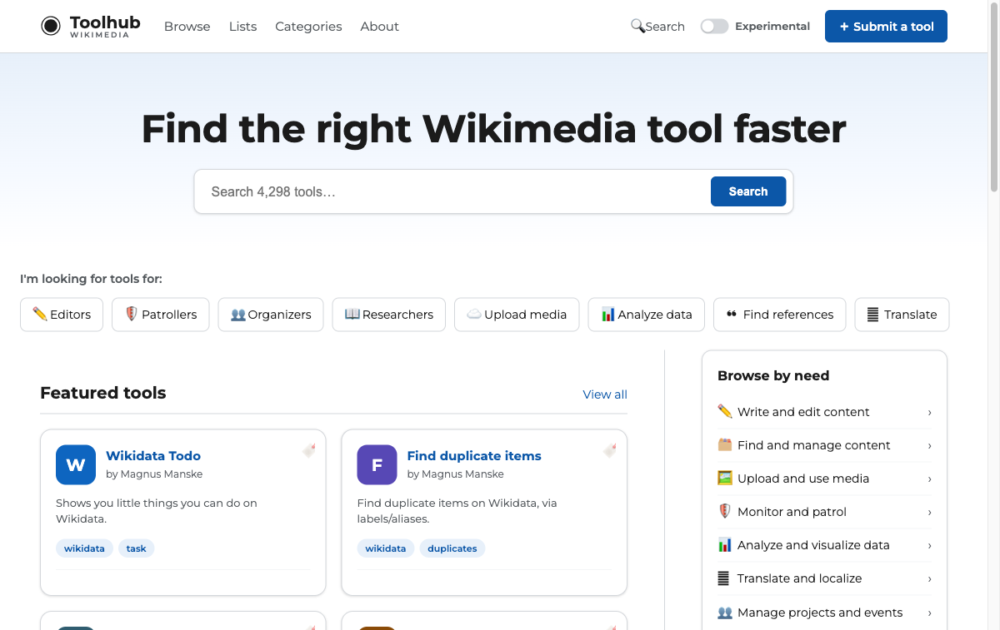

# Toolhub Evolved

A design **demonstrator** for a refreshed [Toolhub](https://toolhub.wikimedia.org/)
— the community catalog of Wikimedia tools. It is a dependency-free single-page
app that reads **live, read-only data** from the public Toolhub API, built to
explore how tool discovery could look and feel.

> This is a prototype, not the production site. All catalog data is real and live
> (read-only, via the public API); a few clearly-labelled metrics are synthesized —
> see the **Experimental toggle** below.



## Highlights

- **Discovery-first home** — search, persona shortcuts, featured tools, curated lists.
- **Faceted browse** (`#/search`) — live Elasticsearch facets (tool type, keywords, audience, language, license, wiki), sort, paginate, shareable URLs.
- **Full tool pages** (`#/tools/:name`) — real metadata (wikis, languages, license, links) + related tools, real revision history.
- **Footer & policy pages** — About, Help, Community, Privacy, Terms, Code of Conduct, API, Feeds.
- **Help maintain Toolhub** (`#/contribute`) — a hub linking source, tasks, translation and docs.
- **Wikimedia brand** — Montserrat + Source Serif 4, the 2022 brand palette, all in `tokens.css`.
- **Experimental toggle** — flip prospective features (popularity, health, reviews, …) on/off. Off = what's shippable against today's API. Each prospective feature is documented in code with what's missing (grep `EXPERIMENTAL`).
- **Accessible & responsive** — keyboard, focus management, AA contrast, no horizontal overflow at any width.

## Architecture

The Toolhub API sends **no CORS headers**, so the browser can't call it directly
from another origin. A tiny Flask app (`proxy/app.py`) solves this by doing two
things from the same origin:

1. Serves the static SPA from `public_html/`.
2. Reverse-proxies read-only `GET /api/*` to `toolhub.wikimedia.org/api/*`.

The SPA (`public_html/app.js`) fetches everything live through `/api/…` — there is
no bundled catalog. Live endpoints used: `/api/search/tools/` (faceted),
`/api/tools/{name}/`, `/api/tools/{name}/revisions/`, `/api/lists/`, `/api/users/`,
`/api/recent/`, `/api/auditlogs/`, `/api/crawler/runs/`, `/api/ui/home/`.

## Repository layout

```
public_html/        ← the static single-page app (served by the proxy)
  index.html        ·  app shell + hash router mount
  app.js            ·  router, views, live API layer, rendering (vanilla JS)
  styles.css        ·  component styles (consume tokens only)
  tokens.css        ·  Wikimedia brand design tokens — single source of truth
proxy/
  app.py            ·  Flask: serves the SPA + read-only /api proxy to Toolhub
  requirements.txt  ·  Flask + requests
tools/
  deploy.sh         ·  Toolforge update helper
TOKENS.md           ·  design-token reference + contribution rules
docs/
  deploy-toolforge.md  ·  step-by-step Toolforge deployment
  screenshots/         ·  reference images
LICENSE             ·  GNU GPL v3.0-or-later
```

## Run locally

The app needs the proxy running (so `/api/*` resolves and CORS is avoided):

```sh
cd proxy
python3 -m venv venv && venv/bin/pip install -r requirements.txt
venv/bin/python app.py
# → http://localhost:8000/   (serves the SPA and proxies /api to Toolhub)
```

## Deploy to Wikimedia Toolforge

See **[docs/deploy-toolforge.md](docs/deploy-toolforge.md)**. In short: create a tool,
clone this repo, point the `python3.13` webservice entrypoint at `proxy/`, build the
virtualenv inside the runtime image, and start the webservice.

## License

GNU General Public License v3.0 or later (GPL-3.0-or-later). See [LICENSE](LICENSE).

Catalog data shown is sourced from the Toolhub API and is released under CC0 by the
Wikimedia community; the Wikimedia brand assets follow the
[Wikimedia brand guidelines](https://meta.wikimedia.org/wiki/Brand).
