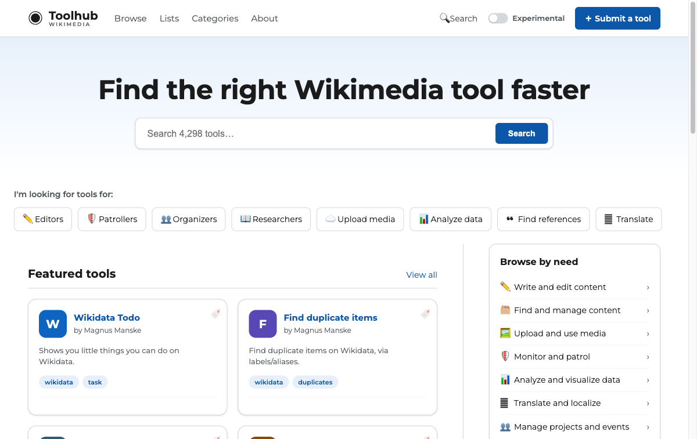

# Toolhub Evolved

A companion interface for [Toolhub](https://toolhub.wikimedia.org/) — the
community catalog of Wikimedia tools. It reads **live Toolhub data** from the
public API, adds an Evolved overlay for extra/local data, and can publish
supported writes back to official Toolhub when users sign in with Toolhub OAuth.

> This runs next to Toolhub, not instead of it. Official Toolhub remains the
> catalog source of truth; Evolved stores only complementary overlay data,
> drafts/fallbacks, and synthetic signals that Toolhub does not expose.



## Highlights

- **Discovery-first home** — search, persona shortcuts, featured tools, curated lists.
- **Faceted browse** (`/search`) — live Elasticsearch facets (tool type, keywords, audience, language, license, wiki), sort, paginate, shareable URLs.
- **Full tool pages** (`/tools/:name`) — real metadata (wikis, languages, license, links) + related tools, real revision history.
- **Footer & policy pages** — About, Help, Community, Privacy, Terms, Code of Conduct, API, Feeds.
- **Help maintain Toolhub** (`/contribute`) — a hub linking source, tasks, translation and docs.
- **Wikimedia brand** — Montserrat + Source Serif 4, the 2022 brand palette, all in `tokens.css`.
- **Evolved feature toggle** — reveal the hybrid layer: official-first writes, local drafts/fallback overlays, and synthetic signals such as popularity, thanks, health, and usage.
- **Accessible & responsive** — keyboard, focus management, AA contrast, no horizontal overflow at any width.

## Architecture

The Toolhub API sends **no CORS headers**, so the browser can't call it directly
from another origin. The Flask app (`proxy/app.py`) serves everything from one
origin:

1. Serves the static SPA from `public_html/`.
2. Reverse-proxies read-only `GET /api/*` to `toolhub.wikimedia.org/api/*`.
3. Hosts the production backend (`proxy/backend/`): Toolhub OAuth sign-in,
   server-side storage of the user's official Toolhub grant, the `/v1/overlay/*`
   API for Evolved-local data, and the `/v1/toolhub/*` bridge that performs
   official Toolhub writes on the user's behalf. Upstream catalog data is never
   mirrored: if a record exists on Toolhub, the live API is its source of truth
   and our database only holds the delta (see
   [`docs/PRODUCTION.md`](docs/PRODUCTION.md)).

The SPA (`public_html/main.js`, `public_html/views/`, and `public_html/lib/`) fetches everything live through `/api/…` — there is
no bundled catalog. Live endpoints used: `/api/search/tools/` (faceted),
`/api/tools/{name}/`, `/api/tools/{name}/revisions/`, `/api/lists/`, `/api/users/`,
`/api/recent/`, `/api/auditlogs/`, `/api/crawler/runs/`, `/api/ui/home/`.

Signed out, user actions stay browser-local (`localStorage` demo mode, behind
the Evolved feature toggle). Signed in with Toolhub, the same localStorage
acts as a synchronous cache of the server overlay: it is pulled from
`GET /v1/overlay/` at boot and overlay mutations write through with
`PUT /v1/overlay/<key>`. Supported create/update/delete actions first call the
official Toolhub API through `/v1/toolhub/*`; when Toolhub rejects a supported
draftable write, Evolved keeps the local draft/overlay so the user's work is
not lost.

## Repository layout

```
public_html/        ← the static single-page app (served by the proxy)
  index.html        ·  app shell + router mount
  main.js           ·  app boot, link interception, event wiring
  views/            ·  route views and rendering logic
  lib/              ·  shared core, atoms, molecules, and organisms
  styles/           ·  component styles and Wikimedia brand design tokens
proxy/
  app.py            ·  Flask: serves the SPA + read-only /api proxy to Toolhub
  requirements.txt  ·  Flask + requests
tools/
  deploy.sh         ·  Toolforge update helper
TOKENS.md           ·  design-token reference + contribution rules
docs/
  FEATURES.md          ·  generated feature listing from public_html/views/experiments.js
  PLAN.md              ·  the comprehensive roadmap (ship lane + experiments lane)
  AUDIT-i18n-a11y.md   ·  detailed i18n / accessibility findings
  deploy-toolforge.md  ·  step-by-step Toolforge deployment
  screenshots/         ·  reference images
LICENSE             ·  GNU GPL v3.0-or-later
```

## Roadmap

See **[docs/PLAN.md](docs/PLAN.md)** for the original demonstrator roadmap and
**[docs/PRODUCTION.md](docs/PRODUCTION.md)** for the production architecture.
The current direction is hybrid: live Toolhub reads remain canonical, supported
signed-in writes publish through official Toolhub OAuth, and Evolved keeps a
local overlay for drafts, fallback state, and features the official API does
not expose.

## Run locally

The app needs the proxy running (so `/api/*` resolves and CORS is avoided):

```sh
cd proxy
python3 -m venv venv && venv/bin/pip install -r requirements.txt
venv/bin/python app.py
# → http://localhost:8000/   (serves the SPA and proxies /api to Toolhub)
```

## Deploy to Wikimedia Toolforge

See **[docs/deploy-toolforge.md](docs/deploy-toolforge.md)**. In short: create a tool,
clone this repo, point the `python3.13` webservice entrypoint at `proxy/`, build the
virtualenv inside the runtime image, and start the webservice.

## Quality gates

Every push runs the full suite in CI (`.github/workflows/ci.yml`):

- **Formatting / lint** — Prettier, ESLint (architecture-boundary rules + license
  headers, zero warnings), Stylelint (design-token enforcement), cspell.
- **Types** — `tsc --checkJs` in **full strict mode** across the whole app.
- **Tests** — Vitest (happy-dom), with a V8 **coverage gate** (lines ≥ 99 %,
  branches ≥ 95 %); Playwright e2e (smoke + axe accessibility).
- **Hygiene** — knip (dead code), jscpd (duplication), a small AST checker
  (`tools/checks.mjs`: XSS, a11y, dead code, floating promises, HTML balance),
  a JS payload budget, and gitleaks secret scanning.
- **Proxy** — ruff (`select = ALL`, incl. flake8-bandit security), pip-audit,
  and a pytest asserting the CSP + security headers.

**Mutation testing** (Stryker) runs nightly (`.github/workflows/mutation.yml`)
at a **literal 100 % score** over `public_html/**`. The handful of genuinely
equivalent mutants carry documented `// Stryker disable` comments — the project's
only in-code suppressions — indexed in [EQUIVALENTS.md](EQUIVALENTS.md).

## License

GNU General Public License v3.0 or later (GPL-3.0-or-later). See [LICENSE](LICENSE).

Catalog data shown is sourced from the Toolhub API and is released under CC0 by the
Wikimedia community; the Wikimedia brand assets follow the
[Wikimedia brand guidelines](https://meta.wikimedia.org/wiki/Brand).
