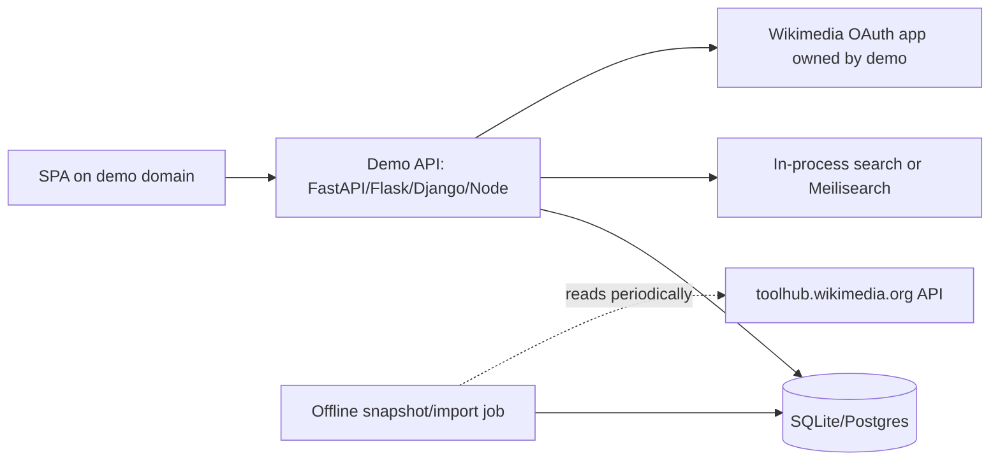
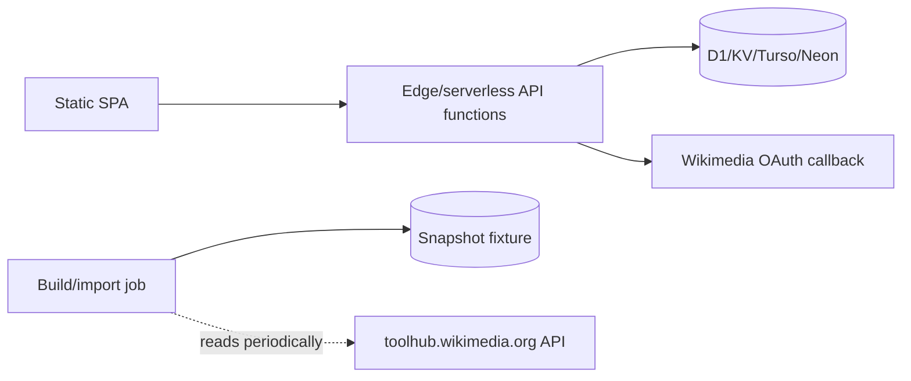
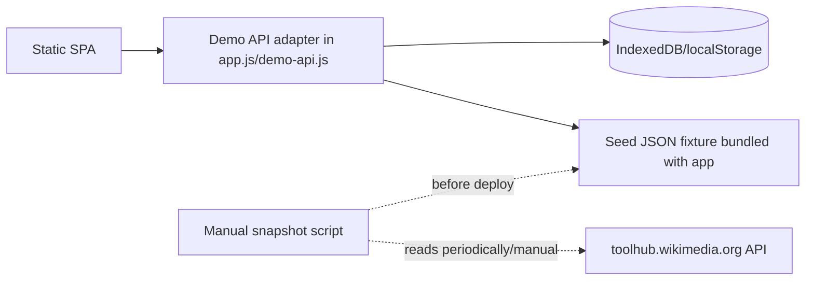
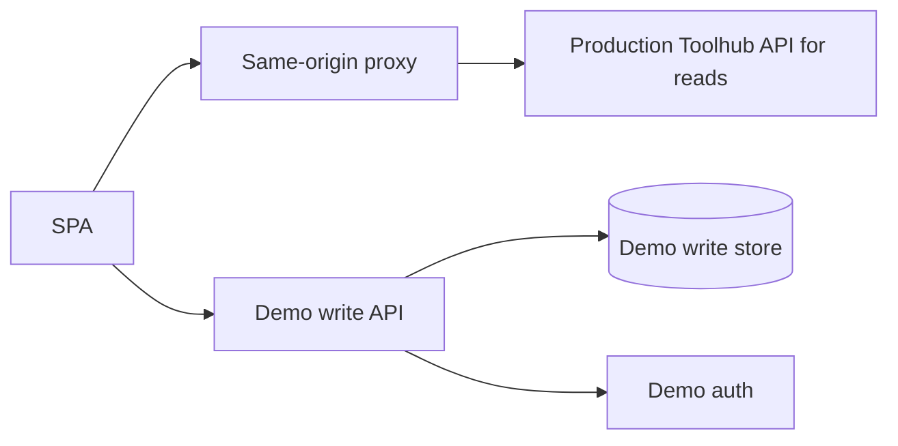

# Standalone Fully-Functioning Demo Plan

Last researched: 2026-06-22.

This plan is for turning this repository's read-only "Toolhub Evolved"
prototype into a fully interactive demo that can run without depending on
`toolhub.wikimedia.org` at runtime and without writing to the production Toolhub
backend.

## 1. Problem Framing

The current repository is intentionally thin:

- [public_html/app.js](/Users/christophehenner/Downloads/Wikimedia/striker/wt-demo-plan/public_html/app.js:82) sets `API_BASE = "/api"` and reads live Toolhub data with `apiGet()`.
- [proxy/app.py](/Users/christophehenner/Downloads/Wikimedia/striker/wt-demo-plan/proxy/app.py:23) serves the static SPA and forwards only `GET /api/*` to `https://toolhub.wikimedia.org/api/*`.
- [README.md](/Users/christophehenner/Downloads/Wikimedia/striker/wt-demo-plan/README.md:27) and [docs/deploy-toolforge.md](/Users/christophehenner/Downloads/Wikimedia/striker/wt-demo-plan/docs/deploy-toolforge.md:7) describe the same-origin proxy as the current architecture.
- Write/auth routes are UI stubs. [public_html/app.js](/Users/christophehenner/Downloads/Wikimedia/striker/wt-demo-plan/public_html/app.js:814) renders `signInPage()`, and the router sends tool edit, annotation edit, list create/edit, favorites, developer settings, and login to that placeholder.

The same-origin coupling exists because Toolhub's API does not expose CORS for
third-party browser origins. A live probe of `GET /api/tools/?page_size=1` on
2026-06-22 returned `Allow: GET, POST, HEAD, OPTIONS` and `Vary: Accept,
Accept-Language, Cookie, Accept-Encoding`, but no
`Access-Control-Allow-Origin`, even when an `Origin: https://example.org` header
was sent. A browser SPA on a different domain therefore cannot call the live API
directly.

"Decoupled" must mean more than moving the read proxy:

- Reads must not be runtime requests to `toolhub.wikimedia.org`. The live API can
  be used by an offline import/snapshot job, but the running demo must read from
  its own fixture, browser store, or demo database.
- Writes must never go to production Toolhub. Favorites, lists, tool creation,
  tool edits, annotations, crawler URL registration, and token/settings flows
  must write to a demo-owned store.
- Auth must be independent. A demo may use Wikimedia OAuth to identify a user,
  but it must register its own OAuth app and map the identity into the demo
  database. It must not rely on Toolhub production sessions or OAuth
  applications.
- The frontend should keep the same API semantics where practical so the demo is
  believable and so future migration to a real backend is possible.

## 2. Toolhub Facts To Preserve

Sources used:

- Live API root: `https://toolhub.wikimedia.org/api/`
- OpenAPI schema: `https://toolhub.wikimedia.org/api/schema/`
- API docs SPA: `https://toolhub.wikimedia.org/api-docs`
- Source tree: `https://gerrit.wikimedia.org/r/plugins/gitiles/wikimedia/toolhub/+/refs/heads/main/`
- Toolinfo schema: `https://gerrit.wikimedia.org/r/plugins/gitiles/wikimedia/toolhub/+/refs/heads/main/jsonschema/toolinfo/1.2.2.json`
- Wikimedia OAuth developer docs: `https://www.mediawiki.org/wiki/OAuth/For_Developers`

Live observations on 2026-06-22:

- Toolhub has 4,329 tools, 77 public lists, 117 crawler URLs, 2,205 users,
  60,256 recent revisions, and 108,208 audit log entries.
- `GET /api/ui/home/` returned `total_tools`, `last_crawl_time`, and
  `last_crawl_changed`.
- Recent crawler runs start hourly and process 117 registered URLs in roughly
  one to two minutes.
- First 100 tool records were about 149 KB raw / 18 KB gzipped, implying roughly
  6.5 MB raw / 0.8 MB gzipped for all tool records. Lists add roughly 0.3 MB raw.
  Full recent/audit history is larger, so the demo should seed only a bounded
  recent slice unless history fidelity is required.

Important API/data model details:

- The API is Django REST Framework plus drf-spectacular OpenAPI.
- Search is Elasticsearch-backed. `/api/search/tools/` returns paginated results
  plus a `facets` object. Facet query params include `tool_type__term`,
  `license__term`, `ui_language__term`, `keywords__term`, `wiki__term`,
  `audiences__term`, `content_types__term`, `tasks__term`,
  `subject_domains__term`, `author__term`, and `origin__term`.
- `toolinfo` schema version `1.2.2` defines a tool as software that helps people
  contribute to or consume Wikimedia projects and associated data. Required
  fields for API-created tools are `name`, `title`, `description`, and `url`.
- Tool records include core metadata and a separate `annotations` object. Core
  fields include `name`, `title`, `description`, `url`, `keywords`, `author`,
  `repository`, `subtitle`, `openhub_id`, `url_alternates`, `bot_username`,
  `deprecated`, `replaced_by`, `experimental`, `for_wikis`, `icon`, `license`,
  `sponsor`, `available_ui_languages`, `technology_used`, `tool_type`,
  `api_url`, `developer_docs_url`, `user_docs_url`, `feedback_url`,
  `privacy_policy_url`, `translate_url`, `bugtracker_url`, `_schema`,
  `_language`, `origin`, `created_by`, `created_date`, `modified_by`, and
  `modified_date`.
- Annotation fields include `wikidata_qid`, `audiences`, `content_types`,
  `tasks`, `subject_domains`, and overridable common fields such as
  `deprecated`, `for_wikis`, `icon`, `available_ui_languages`, `tool_type`,
  `repository`, docs URLs, feedback URL, privacy URL, translate URL, and bug URL.
- `POST /api/tools/` uses `CreateToolRequest`; `PUT /api/tools/{name}/` uses
  `UpdateToolRequest` and does not allow changing `name`.
- `PUT /api/tools/{name}/annotations/` updates annotations independently.
- `POST /api/lists/` and `PUT /api/lists/{id}/` use `EditToolListRequest`:
  `title`, `description`, `icon`, `published`, `tools` as ordered tool names,
  and optional `comment`.
- Favorites are implemented as a personal favorites list. `POST
  /api/user/favorites/` takes `{ "name": "<tool-name>" }`; `DELETE
  /api/user/favorites/{tool_name}/` removes one.
- Crawler URLs are separate resources. `POST /api/crawler/urls/` takes `{ "url":
  "https://..." }`.
- Auth uses Wikimedia OAuth2 through `social_django`; Toolhub's source points at
  `https://meta.wikimedia.org/w/rest.php/oauth2/authorize`,
  `/oauth2/access_token`, and `/oauth2/resource/profile`. Toolhub also exposes
  local OAuth2/token endpoints for API clients under its own domain.
- Toolhub source permissions add an important rule: only `origin="api"` tool
  records can be changed or deleted through the Toolhub API. Crawler-origin
  records are meant to be updated by the crawler.
- Catalog data in this repository is already documented as CC0 in
  [README.md](/Users/christophehenner/Downloads/Wikimedia/striker/wt-demo-plan/README.md:80). The demo should preserve CC0 metadata and include snapshot
  provenance.

## 3. Architecture Options

### Option A: Own Backend + Own Datastore

Description:

Build a same-origin demo API that implements the subset of Toolhub's DRF
endpoints needed by the SPA. Seed the database from a Toolhub snapshot. Store all
demo writes locally. Use mock auth first, then optionally Wikimedia OAuth with a
separate registered application.

Pros:

- Best fidelity for a public demo: shared state, real sessions, real server-side
  crawler URL fetching, real CSRF/session handling.
- Same-origin API avoids CORS entirely without a production Toolhub dependency.
- Data can be reset nightly or per deployment.
- Can be deployed as one Toolforge webservice, one container, or any Python/Node
  host.

Cons:

- More work than a pure static mock.
- Needs database migrations, backup/reset policy, auth secrets, and abuse
  controls if public writes are enabled.
- Search/facets must be reimplemented. A small demo can use SQLite FTS or
  in-memory indexes; production-like relevance would require Elasticsearch or
  another search service.

Cost:

- Toolforge: effectively free for Wikimedia-related demo use.
- Container host: low, typically one small web service and SQLite/Postgres.
- Search add-on, if used: optional.

Effort:

- 1-2 weeks for a credible FastAPI/SQLite API with mock auth and fixture import.
- 2-4 additional days for Wikimedia OAuth and public reset/moderation controls.
- More if exact Elasticsearch relevance is required.

Fidelity:

- High for user journeys, writes, sessions, and shared demo state.
- Medium for search unless a search engine is added.

### Option B: Static Frontend + Serverless/Edge Functions

Description:

Deploy static files to a static host and put API-compatible serverless functions
beside them. Store snapshot data and demo writes in a managed serverless
database.

Pros:

- Low operational burden once deployed.
- Easy to keep the frontend CDN-hosted.
- Runtime remains decoupled from Toolhub if all reads come from the seeded store.
- Can support real Wikimedia OAuth because functions can hold client secrets.

Cons:

- Local development and testing are more complex than a single backend process.
- Serverless platforms vary in request limits, cold starts, SQLite support,
  durable transactions, and scheduled jobs.
- Search/facet code still needs to be implemented.
- Some platforms are less aligned with Wikimedia infrastructure expectations
  than Toolforge.

Cost:

- Usually free/low for demo traffic; may incur managed database costs.

Effort:

- 1.5-3 weeks depending on provider and auth support.

Fidelity:

- High for public shared state.
- Medium for crawler/import behavior unless scheduled functions are added.

### Option C: Pure Frontend Mock Backend

Description:

Bundle a representative snapshot and implement an in-browser API adapter that
returns Toolhub-shaped responses and persists writes to IndexedDB. "Sign in" is a
local demo identity picker. The app can be hosted anywhere static files work.

Pros:

- Lowest cost and fastest path to a fully functioning interactive demo.
- No server, no secrets, no OAuth review, no public write-abuse risk.
- Completely decoupled at runtime.
- Works offline after first load if fixtures are cached.
- Keeps the existing vanilla JS architecture.

Cons:

- State is per browser and cannot be shared between demo users.
- Wikimedia OAuth is simulated, not real.
- Browser cannot reliably fetch arbitrary third-party `toolinfo.json` URLs
  because those URLs may also lack CORS; crawler registration must be simulated
  or accept pasted JSON.
- Large full-history fixtures are not appropriate for static delivery.

Cost:

- Static hosting only. Toolforge, GitHub Pages, Netlify, or local file/server
  all work, though IndexedDB/service workers need `https` or `localhost` for
  some APIs.

Effort:

- 4-8 days for API adapter, fixture import, search/facets, session, and write
  persistence.
- 4-6 more days for the missing forms and route wiring.

Fidelity:

- High for UX and endpoint shapes.
- Medium for auth and public shared-state realism.

### Option D: Thin Live Read Proxy + Independent Write/Identity Overlay

Description:

Keep the current live read proxy for catalog data and add a separate write store
for favorites, lists, annotations, and submitted tools. The frontend overlays
demo writes over live Toolhub reads.

Pros:

- Smaller first backend than Option A.
- Read data stays fresh.
- Useful as a transitional proof of concept while importing/seeding work is not
  ready.

Cons:

- Fails the final decoupling requirement for reads.
- Overlay semantics get confusing: a demo-created tool is not in live search
  unless separately indexed in the write store.
- Runtime availability and CORS coupling remain tied to production Toolhub.
- Users may assume writes affect real Toolhub unless aggressively labeled.

Cost:

- Similar to current Toolforge proxy plus a small database.

Effort:

- 3-6 days for an overlay prototype; more to make search/list merging coherent.

Fidelity:

- Low as a final standalone demo.
- Acceptable only as a temporary stepping stone.

## 4. Recommendation

Use a phased combination of Option C and Option A.

Recommended demo target:

1. Build the API-compatible in-browser backend first. It gives the maintainer a
   fully functioning, low-cost, runtime-decoupled demo quickly and safely. Every
   write feature can work against local persisted state without OAuth secrets or
   public abuse risk.
2. Keep the API adapter contract aligned with Toolhub's OpenAPI paths. Once the
   UX is proven, swap the adapter for a small same-origin FastAPI/SQLite backend
   if public shared state or real Wikimedia OAuth is required.

This is the right tradeoff for a demo because the current product gap is
interactive behavior, not production-grade multi-user infrastructure. It avoids
the biggest risk of Option D: a demo that still depends on live Toolhub and
therefore cannot prove decoupling. It also avoids overbuilding Option A before
the forms and workflows exist.

Recommended runtime modes:

- `demo-local`: bundled fixture + IndexedDB + mock Wikimedia identity. Default
  for static/local demos.
- `demo-server`: same frontend, same endpoint contract, same seeded data, but
  requests go to a demo-owned backend and SQLite/Postgres store.
- `live-readonly`: keep the current proxy only as a maintenance/debug mode, not
  as the standalone demo target.

## 5. Data Model And Seeding

Snapshot import:

- Add a script such as `tools/snapshot-toolhub.mjs` or `tools/snapshot_toolhub.py`.
  It should run outside the browser and fetch live Toolhub only during snapshot
  creation or refresh.
- Fetch:
  - `/api/schema/` for schema provenance.
  - `/api/tools/?page_size=100` until `next` is null.
  - `/api/lists/?page_size=100`.
  - `/api/users/?page_size=100` or a bounded subset of active users referenced
    by tools/lists/revisions.
  - `/api/crawler/urls/?page_size=100`.
  - `/api/crawler/runs/?page_size=100`, but only the newest page or newest N
    runs for the demo.
  - `/api/recent/?page_size=100`, newest 200-500 entries.
  - `/api/auditlogs/?page_size=100`, newest 200-500 entries.
  - `/api/ui/home/`.
- Store under a versioned directory, for example
  `data/snapshots/2026-06-22/manifest.json`, `tools.jsonl`, `lists.jsonl`,
  `users.jsonl`, `crawler-runs.jsonl`, `recent.jsonl`, and `auditlogs.jsonl`.
- Manifest fields should include snapshot timestamp, source API base, source
  schema URL, counts, importer version, and CC0 notice.

Recommended fixture size:

- For the first pure frontend demo, ship a curated 500-1,000 tool subset plus
  all featured lists and enough related tools to make search/list/detail pages
  convincing. This keeps first load small.
- For a server-backed demo, import all current tools and lists. The full tool
  dataset is small enough for SQLite or Postgres.
- Do not ship full recent/audit history in static mode. Seed a bounded recent
  slice and generate new audit/revision rows for local writes.

Demo datastore schema:

- `users`: `id`, `username`, `email`, `date_joined`, `groups`, `social_auth`,
  `is_demo`.
- `tools`: full Toolhub tool fields, keyed by `name`; keep JSON columns for
  arrays/objects in SQLite or IndexedDB.
- `annotations`: keyed by `tool_name`, same fields as Toolhub annotations.
- `tool_lists`: `id`, `title`, `description`, `icon`, `favorites`, `published`,
  `featured`, `created_by`, `created_date`, `modified_by`, `modified_date`.
- `tool_list_items`: `list_id`, `tool_name`, `order`, `added_by`.
- `crawler_urls`: `id`, `url`, `created_by`, `created_date`.
- `crawler_runs` and `crawler_run_urls`: enough fields to satisfy current
  crawler history views.
- `revisions`: `id`, `content_type`, `content_id`, `content_title`, `parent_id`,
  `child_id`, `user`, `timestamp`, `comment`, `patrolled`, `suppressed`,
  `snapshot`.
- `auditlogs`: `id`, `timestamp`, `user`, `target`, `action`, `params`,
  `message`.
- `api_tokens`: local-only tokens for developer settings if that route is kept.

Indexing:

- Build an in-memory search index on startup from `tools` and `annotations`.
- Implement relevance with simple token scoring for demo mode. Preserve sorting
  by `name` and `-modified_date`.
- Compute facets in the Toolhub shape from the filtered result set. The current
  frontend expects nested `facets._filter_<field>.<field>.meta.param` and
  `buckets`.

Refresh:

- Manual refresh is enough for the static demo.
- Server-backed demo can refresh nightly, but refresh must be an import job into
  the demo database, not live reads from the user request path.
- Preserve local demo writes across refresh by separating `snapshot_*` data from
  `demo_*` overlay data, or reset on a documented schedule.

## 6. Auth Plan

Phase 1: mock Wikimedia identity.

- Replace `signInPage()` with a local sign-in flow that creates a session record
  in IndexedDB/localStorage.
- Default identity can remain "Schiste" for demo convenience, but the UI should
  make sign-in explicit and allow "Log out".
- Implement `GET /api/user/` equivalent returning:
  `id`, `username`, `email`, `is_anonymous`, `is_authenticated`, `csrf_token`,
  and a minimal `casl` array.
- Treat CSRF as a no-op in pure browser mode but keep the field to match Toolhub.
- All writes are scoped to the local demo user and clearly labeled as demo-only.

Phase 2: real Wikimedia OAuth, still demo-owned.

- Register a separate OAuth2 application on Meta for the demo domain, with the
  callback URL owned by this standalone app.
- Use Authorization Code flow. Wikimedia docs describe redirecting to
  `rest.php/oauth2/authorize`, exchanging `code` at `rest.php/oauth2/access_token`,
  and reading identity from `rest.php/oauth2/resource/profile` with
  `Authorization: Bearer ...`.
- Store only the user identity and a demo session cookie. Do not store Wikimedia
  access/refresh tokens longer than needed unless there is a clear reason.
- Writes still go only to the demo database.
- For a public demo, default permissions should be conservative:
  - Any signed-in demo user can favorite tools, create lists, submit API-origin
    tools, and edit annotations.
  - Tool core edits can either be allowed for all `origin="api"` demo records or
    restricted to creator/admin. For catalog snapshot records with
    `origin="crawler"`, prefer "suggest edit" as annotations or clone-to-demo
    unless maintainers explicitly want to relax Toolhub's real rule.

Safe public-demo posture:

- Mock auth is safest for design demos and workshops.
- Real OAuth is useful only if the maintainer needs realistic sign-in, shared
  state, or user-specific lists across browsers.
- Never imply that signing in edits production Toolhub.

## 7. API Surface To Implement

Current read endpoints used by `public_html/app.js`:

| Frontend use | Endpoint | Required behavior |
| --- | --- | --- |
| Home total | `GET /api/ui/home/` | Return `total_tools`, `last_crawl_time`, `last_crawl_changed`. |
| Home featured lists | `GET /api/lists/?featured=true&page_size=6` | Return paginated lists with embedded summary tools. |
| Home/recent/search/related | `GET /api/search/tools/` | Support `q`, `page`, `page_size`, `ordering`, and `*__term` facet filters. Return `count`, `next`, `previous`, `results`, `facets`. |
| Tool detail/quick view | `GET /api/tools/{name}/` | Return full tool object including `annotations`. |
| Tool history | `GET /api/tools/{name}/revisions/` | Return revision summaries for the tool. |
| Lists index | `GET /api/lists/?page_size=30` | Return public lists. |
| List detail | `GET /api/lists/{id}/` | Return list with ordered summary tools. |
| Recent changes | `GET /api/recent/` | Return revision feed rows. |
| Members | `GET /api/users/` | Return user detail rows. |
| Crawler history | `GET /api/crawler/runs/` | Return recent crawler runs. |
| Audit logs | `GET /api/auditlogs/` | Return audit entries. |

Write/auth endpoints needed for full interactivity:

| Feature | Endpoint(s) | Demo behavior |
| --- | --- | --- |
| Current user/session | `GET /api/user/`, demo `/login`, demo `/logout` | Return current mock/OAuth user, CASL hints, CSRF token. |
| Favorites | `GET/POST /api/user/favorites/`, `GET/DELETE /api/user/favorites/{tool_name}/` | Store current user's favorites. Return summary tools. |
| Create tool | `POST /api/tools/` | Validate required fields, normalize name/arrays, create `origin="api"`, create annotation row, revision, audit log. |
| Edit tool | `PUT /api/tools/{name}/` | Update core fields for editable records, preserve name, create revision/audit row. |
| Edit annotations | `GET/PUT /api/tools/{name}/annotations/` | Update annotation fields independently; bump tool `modified_by/date`; create revision/audit row. |
| Lists | `POST /api/lists/`, `PUT/DELETE /api/lists/{id}/` | Create/update/delete user lists and ordered tool contents. |
| List history | `GET /api/lists/{id}/revisions/` | Return local revision summaries for list edits. |
| Crawler URLs | `GET/POST /api/crawler/urls/`, `GET /api/crawler/urls/self/`, `DELETE /api/crawler/urls/{id}/` | Register URLs in the demo store. In browser-only mode, simulate crawl or require pasted JSON. In server mode, fetch URL server-side. |
| Developer settings | `GET/POST/DELETE /api/user/authtoken/`, `GET/POST /api/oauth/applications/` if shown | Local-only token/application records, or hide until server mode. |

Frontend changes in `public_html/app.js`:

- Replace `apiGet(path, params)` with a small `apiRequest(method, path, params,
  body)` wrapper.
- Add `apiPost`, `apiPut`, and `apiDelete`.
- Add a mode switch:
  - `window.TOOLHUB_API_MODE === "network"` uses `fetch("/api/...")`.
  - default demo mode calls a local `demoApi.request()` implementation.
- Keep `normalizeTool()` and `normalizeList()` initially, but extend
  `normalizeTool()` to prefer annotation fallback for `icon` and `tool_type`
  where the current UI already expects Toolhub summary semantics.
- Replace `signInPage()` routes with real views/forms:
  - `#/login`
  - `#/favorites`
  - `#/my-lists`
  - `#/lists/create`
  - `#/lists/:id/edit`
  - `#/tools/:name/edit`
  - `#/tools/:name/edit-annotations`
  - `#/add-or-remove-tools`
  - `#/developer-settings`
- Change [public_html/index.html](/Users/christophehenner/Downloads/Wikimedia/striker/wt-demo-plan/public_html/index.html:32) "Submit a tool" from the production URL to `#/tools/create` or `#/add-or-remove-tools`.
- Add optimistic UI only after the API/store semantics are correct. The demo
  should first favor clear success/error states and persistence.

## 8. Write Feature Plan

Favorites:

- Add save buttons to tool cards, quick view, and tool detail.
- `POST /api/user/favorites/` creates a favorite item if not already present.
- `DELETE /api/user/favorites/{tool_name}/` removes it.
- `#/favorites` lists saved tools and supports remove.

Lists CRUD:

- `#/my-lists` lists current user's non-favorites lists.
- `#/lists/create` and `#/lists/:id/edit` edit `title`, `description`, `icon`,
  `published`, and an ordered set of tool names.
- Tool selection can use current search/autocomplete. For Phase 1, simple
  search-by-name/title is enough.
- Save writes through `POST/PUT /api/lists/`.
- Delete writes through `DELETE /api/lists/{id}/`.
- Public `#/lists` continues to show `published=true` lists plus current user's
  private lists when signed in, matching Toolhub's queryset behavior.

Tool submit/edit:

- Add `#/tools/create` or fold create into `#/add-or-remove-tools`.
- Validate `name`, `title`, `description`, `url`.
- Support common fields first: authors, keywords, repository, license,
  tool_type, for_wikis, available_ui_languages, docs/feedback/bug URLs,
  deprecated/experimental flags.
- Store `origin="api"` for created tools.
- For snapshot `origin="crawler"` tools, choose one policy:
  - Faithful: core edit disabled; annotation edit enabled.
  - Demo-friendly: allow "copy into demo editable record" with clear labeling.
- Every save creates a revision and audit log entry so history pages stop being
  decorative.

Annotations:

- Add a focused form for audiences, tasks, content types, subject domains,
  Wikidata QID, icon, tool type, docs/feedback links, and status flags.
- Save through `PUT /api/tools/{name}/annotations/`.
- The detail page should show merged display values consistently. Toolhub's
  source distinguishes core and annotation data; the demo UI should label which
  fields are community annotations.

Crawler/add-or-remove tools:

- Phase 1 browser-only:
  - Let users register a URL in the local store.
  - Do not fetch arbitrary URLs from the browser unless CORS allows it.
  - Provide "paste toolinfo JSON" and "load sample toolinfo" actions to simulate
    ingestion.
  - Accept a single tool object or array, matching Toolhub crawler behavior.
- Phase 2 server mode:
  - Fetch URLs server-side with a demo user agent.
  - Validate required fields (`name`, `title`, `description`, `url`) and the
    schema where practical.
  - Upsert demo records as `origin="crawler"`.
  - Record `crawler_runs` and `crawler_run_urls`.

Developer settings:

- For browser mode, either hide OAuth application management or implement local
  demo-only API tokens.
- For server mode, implement API tokens only if they are useful for the demo.
  Otherwise, keep the route but explain "not enabled in this demo" more narrowly
  than today's broad sign-in placeholder.

Reviews, health, popularity, screenshots:

- These are explicitly experimental in current `app.js`. Do not promote them to
  "real" unless the demo defines its own data model.
- If the maintainer wants them interactive, store them as demo-only extensions
  under a separate namespace so they are not confused with Toolhub's current API.

## 9. Deployment

Pure static demo:

- Serve `public_html/` and bundled fixtures from any static host.
- Use a local dev server for IndexedDB/service-worker-friendly testing; avoid
  relying on `file://`.
- No production Toolhub calls at runtime.
- Snapshot refresh is a manual pre-deploy step.

Toolforge single-service demo:

- Replace or extend `proxy/app.py` with a demo backend that serves static files
  and `/api/*` from SQLite/Postgres.
- Use Toolforge only as a separate tool, for example
  `toolhub-evolved-demo.toolforge.org`, never as a path under production
  Toolhub.
- Optional scheduled snapshot refresh can run as a Toolforge job and import into
  the demo database.
- If Wikimedia OAuth is enabled, register callback URLs for this separate
  Toolforge domain.

Container/static+backend:

- Container: one app image with static files, API, SQLite/Postgres connection,
  and import command.
- Static + functions: static host for `public_html`, functions under same domain
  or `/api`, managed database, scheduled import.

Separation from production:

- Use a distinct hostname, app name, OAuth client, database, logs, and user-agent.
- No production Toolhub cookies, sessions, CSRF tokens, API tokens, OAuth
  applications, or write endpoints.
- UI footer/header should say "Standalone demo: data snapshot from Toolhub,
  writes saved only in this demo."

## 10. Migration Path And Estimates

Phase 0: lock the contract (0.5-1 day).

- Commit this plan.
- Add a small endpoint contract document or tests generated from the OpenAPI
  fields above.
- Decide whether Phase 1 ships full snapshot or curated fixture.

Phase 1: snapshot + local read API (1-2 days).

- Add snapshot importer.
- Bundle a curated fixture.
- Implement `demoApi.get()` for current read endpoints.
- Keep existing views working without `proxy/app.py` or live Toolhub.
- Risk: facet/search behavior may differ from Elasticsearch; acceptable if
  documented.

Phase 2: auth + local write store (2-4 days).

- Add IndexedDB/localStorage store and local session.
- Implement `/api/user/`, favorites, list CRUD, and revisions/audit side effects.
- Replace `signInPage()` for favorites, my lists, list create/edit, and login.
- Risk: state migrations in browser storage. Keep a "reset demo data" action.

Phase 3: tool submit/edit/annotations/crawler simulation (3-5 days).

- Add create/edit forms for tools and annotations.
- Add add-or-remove-tools flow with URL registration plus paste/sample JSON
  ingestion.
- Implement history updates and recent/audit feeds from local writes.
- Risk: form scope creep. Start with fields already rendered by detail/search.

Phase 4: public shared backend, if needed (5-8 days).

- Implement FastAPI/SQLite or Flask/SQLite with the same endpoint contract.
- Move store/search code server-side or share fixtures with the browser adapter.
- Add reset job and basic rate limiting.
- Risk: server deployment and shared write abuse.

Phase 5: real Wikimedia OAuth, if needed (2-4 days).

- Register OAuth2 app.
- Implement login callback/session.
- Map Wikimedia profile to demo users.
- Preserve mock-login fallback for local development.
- Risk: OAuth approval/configuration timing and secret handling.

Total:

- Fully functioning local/static demo: roughly 6-12 working days.
- Public shared demo with real OAuth: roughly 2-3 working weeks total.

## 11. Risks

- Search fidelity: Toolhub uses Elasticsearch facets and relevance. A small demo
  index can match response shape but not exact scoring.
- Crawler fidelity in browser-only mode: arbitrary `toolinfo.json` URLs may not
  be fetchable from the browser because of CORS. A server backend is required for
  faithful crawler behavior.
- Auth expectations: real Wikimedia OAuth can make the demo feel production-like,
  so labeling must be explicit that writes are demo-local.
- Public write abuse: any public shared backend needs reset/moderation/rate
  limiting even if it is not production Toolhub.
- Snapshot freshness: a static fixture is intentionally stale. The UI should show
  snapshot date and source.
- Permissions fidelity: Toolhub's real object permissions are nuanced. The demo
  should implement a simple, documented subset rather than pretending to be
  production security.

## 12. Maintainer Decisions

- Is per-browser local persistence acceptable for the first fully functioning
  demo, or must multiple users see shared state?
- Should sign-in be mock-only, real Wikimedia OAuth, or both?
- Should snapshot `origin="crawler"` tools be core-editable for demo convenience,
  or should core edits be limited to demo-created `origin="api"` tools?
- How large should the shipped fixture be: curated 500-1,000 tools or full 4,329
  tools?
- Should crawler registration simulate ingestion with pasted JSON, or is a
  server-side crawler required?
- Should experimental features such as reviews, health, popularity, and
  screenshots remain labeled placeholders, be removed, or become demo-only data?
- What reset policy should a public shared demo use: per session, nightly, manual,
  or never?
- Where should the canonical standalone demo live: Toolforge, static host,
  container host, or fully local only?
